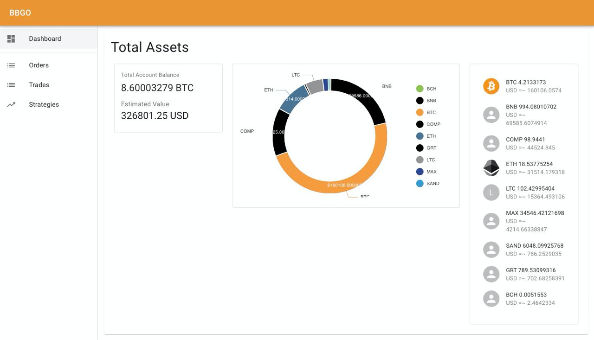

# BBGO

A trading bot framework written in Go. The name bbgo comes from the BB8 bot in the Star Wars movie. aka Buy BitCoin Go!

## Current Status

[](https://github.com/c9s/bbgo/actions/workflows/go.yml)
[](https://hub.docker.com/r/yoanlin/bbgo)


## Community

[](https://t.me/bbgo_intl)
[](https://t.me/bbgocrypto)
[](https://twitter.com/bbgotrading)

## Documentation and General Topics
- Check the [documentation index](doc/README.md)

## Features

- Exchange abstraction interface.
- Stream integration (user data websocket, market data websocket).
- Real-time orderBook integration through websocket.
- TWAP order execution support. See [TWAP Order Execution](./doc/topics/twap.md)
- PnL calculation.
- Slack/Telegram notification.
- Back-testing: KLine-based back-testing engine. See [Back-testing](./doc/topics/back-testing.md)
- Built-in Grid strategy.
- Many built-in strategies.
- Multi-exchange session support: you can connect to more than 2 exchanges with different accounts or subaccounts.
- Standard indicators, e.g., SMA, EMA, BOLL, VMA, MACD...
- React-powered Web Dashboard.
- Docker image ready.
- Kubernetes support.
- Helm chart ready.

## Screenshots

 

## Supported Exchanges

- Binance Spot Exchange (and binance.us)
- FTX Spot Exchange
- OKEx Spot Exchange
- Kucoin Spot Exchange
- MAX Spot Exchange (located in Taiwan)

## BBGO Tokenomics
To support the development of BBGO, we have created a bounty pool to support contributors by giving away $BBG tokens.
Check the details in [$BBG Contract Page](contracts/README.md) and our [official website](https://bbgo.finance)

## Requirements

Get your exchange API key and secret after you register the accounts (you can choose one or more exchanges):

- MAX: <https://max.maicoin.com/signup?r=c7982718>
- Binance: <https://www.binancezh.com/en/register?ref=VGDGLT80>
- FTX: <https://ftx.com/#a=7710474>
- OKEx: <https://www.okex.com/join/2412712?src=from:ios-share>
- Kucoin: <https://www.kucoin.com/ucenter/signup?rcode=r3KX2D4>

Since the exchange implementation and support are done by a small team, if you like the work they've done for you, It
would be great if you can use their referral code as your support to them. :-D

## Installation

### Install from binary

The following script will help you set up a config file, dotenv file:

```sh
# grid trading strategy for binance exchange
bash <(curl -s https://raw.githubusercontent.com/c9s/bbgo/main/scripts/setup-grid.sh) binance

# grid trading strategy for max exchange
bash <(curl -s https://raw.githubusercontent.com/c9s/bbgo/main/scripts/setup-grid.sh) max
```

### One-click Linode StackScript:

- BBGO Grid Trading on Binance <https://cloud.linode.com/stackscripts/950715>
- BBGO USDT/TWD Grid Trading on MAX <https://cloud.linode.com/stackscripts/793380>
- BBGO USDC/TWD Grid Trading on MAX <https://cloud.linode.com/stackscripts/797776>
- BBGO LINK/TWD Grid Trading on MAX <https://cloud.linode.com/stackscripts/797774>
- BBGO USDC/USDT Grid Trading on MAX <https://cloud.linode.com/stackscripts/797777>
- BBGO Standard Grid Trading on MAX <https://cloud.linode.com/stackscripts/795788>

### Build from source

See [Build from source](./doc/build-from-source.md)

## Configuration

Add your dotenv file:

```sh
# for Binance Exchange, if you have one
BINANCE_API_KEY=
BINANCE_API_SECRET=

# if you want to use binance.us, change this to 1
BINANCE_US=0

# for MAX exchange, if you have one
MAX_API_KEY=
MAX_API_SECRET=

# for FTX exchange, if you have one
FTX_API_KEY=
FTX_API_SECRET=
# specify it if credentials are for subaccount
FTX_SUBACCOUNT=

# for OKEx exchange, if you have one
OKEX_API_KEY=
OKEX_API_SECRET=
OKEX_API_PASSPHRASE

# for kucoin exchange, if you have one
KUCOIN_API_KEY=
KUCOIN_API_SECRET=
KUCOIN_API_PASSPHRASE=
KUCOIN_API_KEY_VERSION=2
```

Prepare your dotenv file `.env.local` and BBGO yaml config file `bbgo.yaml`.

To check the available environment variables, please see [Environment Variables](./doc/configuration/envvars.md)


The minimal bbgo.yaml could be generated by:

```sh
curl -o bbgo.yaml https://raw.githubusercontent.com/c9s/bbgo/main/config/minimal.yaml
```


To run strategy:

```sh
bbgo run
```

To start bbgo with the frontend dashboard:

```sh
bbgo run --enable-webserver
```


If you want to switch to other dotenv file, you can add an `--dotenv` option or `--config`:

```sh
bbgo sync --dotenv .env.dev --config config/grid.yaml --session binance
```


To query transfer history:

```sh
bbgo transfer-history --session max --asset USDT --since "2019-01-01"
```

To calculate pnl:

```sh
bbgo pnl --exchange binance --asset BTC --since "2019-01-01"
```


## Advanced Configuration

### Testnet (Paper Trading)

Currently only supports binance testnet.
To run bbgo in testnet, apply new API keys from [Binance Test Network](https://testnet.binance.vision), and set the following env before you start bbgo:
```bash
export PAPER_TRADE=1
export DISABLE_MARKET_CACHE=1 # the symbols supported in testnet is far less than the mainnet
```

### Notification

- [Setting up Telegram notification](./doc/configuration/telegram.md)
- [Setting up Slack notification](./doc/configuration/slack.md)

### Synchronizing Trading Data

By default, BBGO does not sync your trading data from the exchange sessions, so it's hard to calculate your profit and
loss correctly.

By synchronizing trades and orders to the local database, you can earn some benefits like PnL calculations, backtesting
and asset calculation.

#### Configure MySQL Database

To use MySQL database for data syncing, first you need to install your mysql server:

```sh
# For Ubuntu Linux
sudo apt-get install -y mysql-server
```

Or [run it in docker](https://hub.docker.com/_/mysql)

Create your mysql database:

```sh
mysql -uroot -e "CREATE DATABASE bbgo CHARSET utf8"
```

Then put these environment variables in your `.env.local` file:

```sh
DB_DRIVER=mysql
DB_DSN="user:password@tcp(127.0.0.1:3306)/bbgo"
```

#### Configure Sqlite3 Database

Just put these environment variables in your `.env.local` file:

```sh
DB_DRIVER=sqlite3
DB_DSN=bbgo.sqlite3
```

## Synchronizing your own trading data

Once you have your database configured, you can sync your own trading data from the exchange.

See [Configure Sync For Private Trading Data](./doc/configuration/sync.md)

## Using Redis to keep persistence between BBGO sessions

To use Redis, first you need to install your Redis server:

```sh
# For Ubuntu/Debian Linux
sudo apt-get install -y redis
```

Set the following environment variables in your `bbgo.yaml`:

```yaml
persistence:
  redis:
    host: 127.0.0.1  # The IP address or the hostname to your Redis server, 127.0.0.1 if same as BBGO  
    port: 6379  # Port to Redis server, default 6379
    db: 0  # DB number to use. You can set to another DB to avoid conflict if other applications are using Redis too.
```

## Built-in Strategies

Check out the strategy directory [strategy](pkg/strategy) for all built-in strategies:

- `pricealert` strategy demonstrates how to use the notification system [pricealert](pkg/strategy/pricealert). See
  [document](./doc/strategy/pricealert.md).
- `xpuremaker` strategy demonstrates how to maintain the orderbook and submit maker
  orders [xpuremaker](pkg/strategy/xpuremaker)
- `buyandhold` strategy demonstrates how to subscribe kline events and submit market
  order [buyandhold](pkg/strategy/pricedrop)
- `bollgrid` strategy implements a basic grid strategy with the built-in bollinger
  indicator [bollgrid](pkg/strategy/bollgrid)
- `grid` strategy implements the fixed price band grid strategy [grid](pkg/strategy/grid). See
  [document](./doc/strategy/grid.md).
- `support` strategy implements the fixed price band grid strategy [support](pkg/strategy/support). See
  [document](./doc/strategy/support.md).
- `flashcrash` strategy implements a strategy that catches the flashcrash [flashcrash](pkg/strategy/flashcrash)

To run these built-in strategies, just modify the config file to make the configuration suitable for you, for example if
you want to run
`buyandhold` strategy:

```sh
vim config/buyandhold.yaml

# run bbgo with the config
bbgo run --config config/buyandhold.yaml
```

## Back-testing

See [Back-testing](./doc/topics/back-testing.md)

## Adding New Built-in Strategy

Fork and clone this repository, Create a directory under `pkg/strategy/newstrategy`, write your strategy
at `pkg/strategy/newstrategy/strategy.go`.

Define a strategy struct:

```go
package newstrategy

import (
	"github.com/c9s/bbgo/pkg/fixedpoint"
)

type Strategy struct {
	Symbol string           `json:"symbol"`
	Param1 int              `json:"param1"`
	Param2 int              `json:"param2"`
	Param3 fixedpoint.Value `json:"param3"`
}
```

Register your strategy:

```go
package newstrategy

const ID = "newstrategy"

const stateKey = "state-v1"

var log = logrus.WithField("strategy", ID)

func init() {
	bbgo.RegisterStrategy(ID, &Strategy{})
}
```

Implement the strategy methods:

```go
package newstrategy

func (s *Strategy) Subscribe(session *bbgo.ExchangeSession) {
	session.Subscribe(types.KLineChannel, s.Symbol, types.SubscribeOptions{Interval: "2m"})
}

func (s *Strategy) Run(ctx context.Context, orderExecutor bbgo.OrderExecutor, session *bbgo.ExchangeSession) error {
	// ....
	return nil
}
```

Edit `pkg/cmd/builtin.go`, and import the package, like this:

```go
package cmd

// import built-in strategies
import (
	_ "github.com/c9s/bbgo/pkg/strategy/bollgrid"
	_ "github.com/c9s/bbgo/pkg/strategy/buyandhold"
	_ "github.com/c9s/bbgo/pkg/strategy/flashcrash"
	_ "github.com/c9s/bbgo/pkg/strategy/grid"
	_ "github.com/c9s/bbgo/pkg/strategy/pricealert"
	_ "github.com/c9s/bbgo/pkg/strategy/support"
	_ "github.com/c9s/bbgo/pkg/strategy/swing"
	_ "github.com/c9s/bbgo/pkg/strategy/trailingstop"
	_ "github.com/c9s/bbgo/pkg/strategy/xmaker"
	_ "github.com/c9s/bbgo/pkg/strategy/xpuremaker"
)
```

## Write your own strategy

Create your go package, and initialize the repository with `go mod` and add bbgo as a dependency:

```sh
go mod init
go get github.com/c9s/bbgo@main
```

Write your own strategy in the strategy file:

```sh
vim strategy.go
```

You can grab the skeleton strategy from <https://github.com/c9s/bbgo/blob/main/pkg/strategy/skeleton/strategy.go>

Now add your config:

```sh
mkdir config
(cd config && curl -o bbgo.yaml https://raw.githubusercontent.com/c9s/bbgo/main/config/minimal.yaml)
```

Add your strategy package path to the config file `config/bbgo.yaml`

```yaml
---
build:
  dir: build
  imports:
  - github.com/your_id/your_swing
  targets:
  - name: swing-amd64-linux
    os: linux
    arch: amd64
  - name: swing-amd64-darwin
    os: darwin
    arch: amd64
```

Run `bbgo run` command, bbgo will compile a wrapper binary that imports your strategy:

```sh
dotenv -f .env.local -- bbgo run --config config/bbgo.yaml
```

Or you can build your own wrapper binary via:

```shell
bbgo build --config config/bbgo.yaml
```

## Command Usages

### Submitting Orders to a specific exchagne session

```shell
bbgo submit-order --session=okex --symbol=OKBUSDT --side=buy --price=10.0 --quantity=1
```

### Listing Open Orders of a specific exchange session

```sh
bbgo list-orders open --session=okex --symbol=OKBUSDT
bbgo list-orders open --session=ftx --symbol=FTTUSDT
bbgo list-orders open --session=max --symbol=MAXUSDT
bbgo list-orders open --session=binance --symbol=BNBUSDT
```

### Canceling an open order

```shell
# both order id and symbol is required for okex
bbgo cancel-order --session=okex --order-id=318223238325248000 --symbol=OKBUSDT

# for max, you can just give your order id
bbgo cancel-order --session=max --order-id=1234566
```

### Debugging user data stream

```shell
bbgo userdatastream --session okex
bbgo userdatastream --session max
bbgo userdatastream --session binance
```

## Dynamic Injection

In order to minimize the strategy code, bbgo supports dynamic dependency injection.

Before executing your strategy, bbgo injects the components into your strategy object if it found the embedded field
that is using bbgo component. for example:

```go
type Strategy struct {
*bbgo.Notifiability
}
```

And then, in your code, you can call the methods of Notifiability.

Supported components (single exchange strategy only for now):

- `*bbgo.Notifiability`
- `bbgo.OrderExecutor`

If you have `Symbol string` field in your strategy, your strategy will be detected as a symbol-based strategy, then the
following types could be injected automatically:

- `*bbgo.ExchangeSession`
- `types.Market`

## Strategy Execution Phases

1. Load config from the config file.
2. Allocate and initialize exchange sessions.
3. Add exchange sessions to the environment (the data layer).
4. Use the given environment to initialize the trader object (the logic layer).
5. The trader initializes the environment and start the exchange connections.
6. Call strategy.Run() method sequentially.

## Exchange API Examples

Please check out the example directory: [examples](examples)

Initialize MAX API:

```go
key := os.Getenv("MAX_API_KEY")
secret := os.Getenv("MAX_API_SECRET")

maxRest := maxapi.NewRestClient(maxapi.ProductionAPIURL)
maxRest.Auth(key, secret)
```

Creating user data stream to get the orderbook (depth):

```go
stream := max.NewStream(key, secret)
stream.Subscribe(types.BookChannel, symbol, types.SubscribeOptions{})

streambook := types.NewStreamBook(symbol)
streambook.BindStream(stream)
```

## Deployment

- [Helm Chart](./doc/deployment/helm-chart.md)
- Baremetal machine or a VPS

## Development

- [Adding New Exchange](./doc/development/adding-new-exchange.md)
- [Migration](./doc/development/migration.md)

### Setting up your local repository

1. Click the "Fork" button from the GitHub repository.
2. Clone your forked repository into `$GOPATH/github.com/c9s/bbgo`.
3. Change directory into `$GOPATH/github.com/c9s/bbgo`.
4. Create a branch and start your development.
5. Test your changes.
6. Push your changes to your fork.
7. Send a pull request.

### Setup frontend development environment

```sh
cd frontend
yarn install
```

### Testing Desktop App

for webview

```sh
make embed && go run -tags web ./cmd/bbgo-webview
```

for lorca

```sh
make embed && go run -tags web ./cmd/bbgo-lorca
```

## FAQ

What's Position?

- Base Currency & Quote Currency <https://www.ig.com/au/glossary-trading-terms/base-currency-definition>
- How to calculate average cost? <https://www.janushenderson.com/en-us/investor/planning/calculate-average-cost/>

## Contributing

See [Contributing](./CONTRIBUTING.md)

### Financial Contributors

<object type="image/svg+xml" data="https://opencollective.com/bbgo/tiers/backer.svg?avatarHeight=36&width=600"></object>

## Supporter

- GitBook

## License

MIT License
