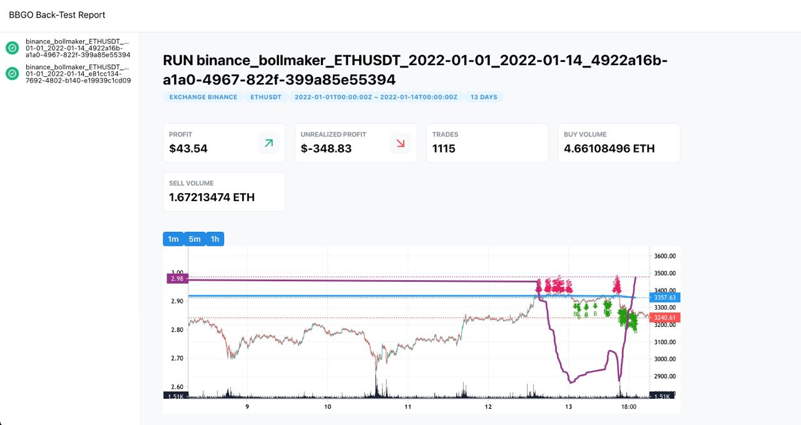

* [English](./README.md)
* [中文👈](./README.zh_TW.md)

# BBGO 

一個用Go編寫的現代加密貨幣交易機器人框架。
A modern crypto trading bot framework written in Go.


## 目前狀態

[](https://github.com/c9s/bbgo/actions/workflows/go.yml)
[](https://pkg.go.dev/github.com/c9s/bbgo)
[](https://goreportcard.com/report/github.com/c9s/bbgo)
[](https://hub.docker.com/r/yoanlin/bbgo)
[](http://codecov.io/github/c9s/bbgo?branch=main)


## 社群

[](https://t.me/bbgo_intl)
[](https://t.me/bbgocrypto)
[](https://twitter.com/bbgotrading)

## 你可以用 BBGO 做什麼
### 交易機器人用戶 💁‍♀️ 💁‍♂️
您可以使用 BBGO 運行內置策略。

### 策略開發者 🥷
您可以使用 BBGO 的交易單元和回測單元來實現您自己的策略。

### 交易單元開發者 🧑‍💻
您可以使用 BBGO 的底層共用交易所 API；目前它支持 4+ 個主要交易所，因此您不必重複實現。

## 特色
* 交易所抽象介面。
* 整合串流（用戶資料 websocket，市場資料 websocket）。
* 通過 websocket 實時訂單簿整合。
* TWAP 訂單執行支持。參見 [TWAP 訂單執行](./doc/topics/twap.md)
* 盈虧計算。
* Slack / Telegram 通知。
* 回測：基於K線的回測引擎。參見[回測](./doc/topics/back-testing.md)
* 內置參數優化工具。
* 內置網格策略和許多其他內置策略。
* 多交易所 session 支持：您可以連接到2個以上不同帳戶或子帳戶的交易所。
* 類似於 `pandas.Series` 的指標介面 ([series](https://github.com/c9s/bbgo/blob/main/doc/development/series.md))([usage](https://github.com/c9s/bbgo/blob/main/doc/development/indicator.md))
  - [Accumulation/Distribution Indicator](./pkg/indicator/ad.go)
  - [Arnaud Legoux Moving Average](./pkg/indicator/alma.go)
  - [Average True Range](./pkg/indicator/atr.go)
  - [Bollinger Bands](./pkg/indicator/boll.go)
  - [Commodity Channel Index](./pkg/indicator/cci.go)
  - [Cumulative Moving Average](./pkg/indicator/cma.go)
  - [Double Exponential Moving Average](./pkg/indicator/dema.go)
  - [Directional Movement Index](./pkg/indicator/dmi.go)
  - [Brownian Motion's Drift Factor](./pkg/indicator/drift.go)
  - [Ease of Movement](./pkg/indicator/emv.go)
  - [Exponentially Weighted Moving Average](./pkg/indicator/ewma.go)
  - [Hull Moving Average](./pkg/indicator/hull.go)
  - [Trend Line (Tool)](./pkg/indicator/line.go)
  - [Moving Average Convergence Divergence Indicator](./pkg/indicator/macd.go)
  - [On-Balance Volume](./pkg/indicator/obv.go)
  - [Pivot](./pkg/indicator/pivot.go)
  - [Running Moving Average](./pkg/indicator/rma.go)
  - [Relative Strength Index](./pkg/indicator/rsi.go)
  - [Simple Moving Average](./pkg/indicator/sma.go)
  - [Ehler's Super Smoother Filter](./pkg/indicator/ssf.go)
  - [Stochastic Oscillator](./pkg/indicator/stoch.go)
  - [SuperTrend](./pkg/indicator/supertrend.go)
  - [Triple Exponential Moving Average](./pkg/indicator/tema.go)
  - [Tillson T3 Moving Average](./pkg/indicator/till.go)
  - [Triangular Moving Average](./pkg/indicator/tma.go)
  - [Variable Index Dynamic Average](./pkg/indicator/vidya.go)
  - [Volatility Indicator](./pkg/indicator/volatility.go)
  - [Volume Weighted Average Price](./pkg/indicator/vwap.go)
  - [Zero Lag Exponential Moving Average](./pkg/indicator/zlema.go)
  - 更多...

## 截圖




## 內建策略

| 策略    | 描述                                                                                                                             | 交易類型       | 是否支援回測 |
|-------------|-----------------------------------------------------------------------------------------------------------------------------------------|------------|------------------|
| grid        | 第一代網格策略，提供更多的靈活性，但您需要準備庫存。 | maker      |                  |
| grid2       | 第二代網格策略，可以將您的報價資產轉換成網格，支持基礎+報價模式。 | maker      |                  |
| bollgrid    | 實現了一個基本的網格策略，內置布林通道 (bollinger band)。 | maker      |                  | 
| xmaker      | 跨交易所市場製造策略，它在另一邊對您的庫存風險進行對沖。   | maker      | 不               |
| xnav        | 這個策略幫助您記錄當前的淨資產價值。   | tool       | 不               |
| xalign      | 這個策略自動對齊您的餘額位置。   | tool       | 不               |
| xfunding    | 一種資金費率策略。   | funding    | 不               |
| autoborrow  | 這個策略使用保證金借入資產，幫助您保持最小餘額。 | tool       | 不               |
| pivotshort  | 這個策略找到支點低點並在價格突破前一低點時進行交易。    | long/short |                  |
| schedule    | 這個策略定期以固定數量買賣，您可以將其用作單一的DCA，或補充像BNB這樣的費用資產。   | tool       |
| irr         | 這個策略基於預測的回報率開倉。   | long/short |                  |
| bollmaker   | 這個策略持有長期多空倉位，在兩邊下單，並使用布林通道 (bollinger band) 控制倉位大小。| maker      |                  |
| wall        | 這個策略在訂單簿上創建一堵牆（大量訂單）。        | maker      | 不               |
| scmaker     | 這個市場製造策略是為穩定幣市場設計的，如USDC/USDT。   | maker      |                  |
| drift       |    | long/short |                  |
| rsicross    | 這個策略在快速 RSI 越過慢速 RSI 時開啟多倉，這是使用 v2 指標的演示策略。     | long/short |                  |
| marketcap   | 這個策略實現了一個基於市值資本化重新平衡投資組合的策略。   | rebalance  | 不               |
| supertrend  | 這個策略使用 DEMA 和超級趨勢指標開啟多空倉位。   | long/short |                  |
| trendtrader | 這個策略基於趨勢線突破開啟多空倉位。     | long/short |                  |
| elliottwave |  | long/short |                  |
| ewoDgtrd    |  | long/short |                  |
| fixedmaker  |  | maker      |                  |
| factoryzoo  |  | long/short |                  |
| fmaker      |  | maker      |                  |
| linregmaker | 一個基於線性回歸的市場製造商。   | maker      |                  |
| convert     | 轉換策略是一個幫助您將特定資產轉換為目標資產的工具。     | tool       | 不               |

## 已支援交易所

- Binance Spot Exchange (以及 binance.us)
- OKEx Spot Exchange
- Kucoin Spot Exchange
- MAX Spot Exchange (台灣交易所)
- Bitget Exchange
- Bybit Exchange

## 文件

- [參考文件](doc/README.md)

## 要求

* Go SDK 1.20
* Linux / MacOS / Windows (WSL)
* 在您註冊賬戶後獲取您的交易所 API 密鑰和密碼（您可以選擇一個或多個交易所）：
  - MAX: https://max.maicoin.com/signup?r=c7982718
  - Binance: https://accounts.binance.com/en/register?ref=38192708
  - OKEx: https://www.okex.com/join/2412712?src=from:ios-share
  - Kucoin: https://www.kucoin.com/ucenter/signup?rcode=r3KX2D4

這個項目由一小群人維護和支持。如果您想支持這個項目，請使用上面提供的鏈接和推薦碼在交易所註冊。

## 安裝

### 從 binary 安裝

以下 script 將幫助你設置文件和 dotenv 文件：

```sh
# 針對 Binance 交易所的網格交易策略
bash <(curl -s https://raw.githubusercontent.com/c9s/bbgo/main/scripts/setup-grid.sh) binance

# 針對 MAX 交易所的網格交易策略
bash <(curl -s https://raw.githubusercontent.com/c9s/bbgo/main/scripts/setup-grid.sh) max

# 針對 Binance 交易所的布林格網格交易策略
bash <(curl -s https://raw.githubusercontent.com/c9s/bbgo/main/scripts/setup-bollgrid.sh) binance

# 針對 MAX 交易所的布林格網格交易策略
bash <(curl -s https://raw.githubusercontent.com/c9s/bbgo/main/scripts/setup-bollgrid.sh) max
```

如果您已經在某處有配置，則可能適合您的是僅下載腳本：

```sh
bash <(curl -s https://raw.githubusercontent.com/c9s/bbgo/main/scripts/download.sh)
```

或者參考[發布頁面](https://github.com/c9s/bbgo/releases)並手動下載。

自 v2 起，我們添加了一個新的浮點實現 dnum，以支持更高精度的小數。要下載和設置，請參考[Dnum安裝](doc/topics/dnum-binary.md)

### 一鍵Linode StackScript

StackScript 允許您一鍵部署一個輕量級實體與 bbgo。

- BBGO grid on Binance <https://cloud.linode.com/stackscripts/950715>
- BBGO grid USDT/TWD on MAX <https://cloud.linode.com/stackscripts/793380>
- BBGO grid USDC/TWD on MAX <https://cloud.linode.com/stackscripts/797776>
- BBGO grid LINK/TWD on MAX <https://cloud.linode.com/stackscripts/797774>
- BBGO grid USDC/USDT on MAX <https://cloud.linode.com/stackscripts/797777>
- BBGO grid on MAX <https://cloud.linode.com/stackscripts/795788>
- BBGO bollmaker on Binance <https://cloud.linode.com/stackscripts/1002384>

### 從程式碼構建
參見[從程式碼構建](./doc/build-from-source.md)

## 配置

添加您的 dotenv 文件：

```sh
# 針對 Binance 交易所
BINANCE_API_KEY=
BINANCE_API_SECRET=

# 如果您想使用 binance.us，將此更改為1
BINANCE_US=0

# 針對 MAX 交易所
MAX_API_KEY=
MAX_API_SECRET=

# 針對 OKEx 交易所
OKEX_API_KEY=
OKEX_API_SECRET=
OKEX_API_PASSPHRASE

# 針對 Kucoin 交易所
KUCOIN_API_KEY=
KUCOIN_API_SECRET=
KUCOIN_API_PASSPHRASE=
KUCOIN_API_KEY_VERSION=2

# 針對 Bybit 交易所
BYBIT_API_KEY=
BYBIT_API_SECRET=
```

準備您的dotenv文件 `.env.local` 和 BBGO yaml 配置文件 `bbgo.yaml`。

要檢查可用的環境變量，請參見[環境變量](./doc/configuration/envvars.md)

最小的 bbgo.yaml 可以通過以下方式生成：

```sh
curl -o bbgo.yaml https://raw.githubusercontent.com/c9s/bbgo/main/config/minimal.yaml
```

要運行策略

```sh
bbgo run
```

要啟動帶有前端儀表板的 bbgo

```sh
bbgo run --enable-webserver
```

如果您想切換到另一個 dotenv 文件，您可以添加 `--dotenv` 選項或 `--config` :

```sh
bbgo sync --dotenv .env.dev --config config/grid.yaml --session binance
```

要查詢轉賬歷史

```sh
bbgo transfer-history --session max --asset USDT --since "2019-01-01"
```

<!--
計算盈虧：

```sh
bbgo pnl --exchange binance --asset BTC --since "2019-01-01"
```
--->

## 進階配置

### 與 Binance 同步系統時間

 BBGO 提供了用於 UNIX 系統 / 子系統的腳本，以便與 Binance 同步日期。需要事先安裝 jq 和 bc。在 Ubuntu 中安裝相依套件，嘗試以下命令：

```bash
sudo apt install -y bc jq
```

要同步日期，嘗試

```bash
sudo ./scripts/sync_time.sh
```

您還可以將腳本添加到 crontab 中，這樣系統時間就可以定期與 Binance 同步

### Testnet (Paper Trading)

目前僅支持 [Binance Test Network](https://testnet.binance.vision)

```bash
export PAPER_TRADE=1
export DISABLE_MARKET_CACHE=1 # 測試網路支援的市場遠少於主網路
```

### 通知 

- [設定 Telegram 通知](./doc/configuration/telegram.md)
- [設定 Slack 通知](./doc/configuration/slack.md)

### 同步交易資料

預設情況下， BBGO 不會從交易所同步您的交易資料，因此很難正確計算您的盈虧。

通過將交易和訂單同步到本地資料庫，您可以獲得一些好處，如盈虧計算、回測和資產計算。

您只能使用一個資料庫驅動程序 MySQL 或 SQLite 來存儲您的交易資料。

**注意**：SQLite 不完全支援，我們建議您使用 MySQL 而不是 SQLite。

配置 MySQL 資料庫
要使用 MySQL 資料庫進行資料同步，首先您需要安裝 MySQL 服務器：
#### Configure MySQL Database

```sh
# Ubuntu Linux
sudo apt-get install -y mysql-server

# 對於更新的 Ubuntu Linux
sudo apt install -y mysql-server
```

或者[在 docker 中執行它](https://hub.docker.com/_/mysql)

創建您的 mysql 資料庫：

Create your mysql database:

```sh
mysql -uroot -e "CREATE DATABASE bbgo CHARSET utf8"
```

然後將這些環境變數放入您的 `.env.local` 文件中：

```sh
DB_DRIVER=mysql
DB_DSN="user:password@tcp(127.0.0.1:3306)/bbgo"
```

#### Configure Sqlite3 Database

配置 Sqlite3 資料庫
要使用 SQLite3 而不是 MySQL，只需將這些環境變數放入您的 `.env.local` 文件中：

```sh
DB_DRIVER=sqlite3
DB_DSN=bbgo.sqlite3
```

## 同步您自己的交易資料

一旦您配置了資料庫，您就可以從交易所同步您自己的交易資料。

參見[配置私人交易資料同步](./doc/configuration/sync.md)

## 使用 Redis 在 BBGO  session 之間保持持久性

要使用 Redis，首先您需要安裝您的 Redis 服務器

```sh
# 對於 Ubuntu/Debian Linux
sudo apt-get install -y redis

# 對於更新的 Ubuntu/Debian Linux
sudo apt install -y redis
```

在您的 `bbgo.yaml` 中設定以下環境變數：

```yaml
persistence:
  redis:
    host: 127.0.0.1  # 指向您的 Redis 服務器的 IP 地址或主機名，如果與 BBGO 相同則為 127.0.0.1
    port: 6379  # Redis 服務器的端口，預設為 6379
    db: 0  # 使用的 DB 號碼。如果其他應用程序也在使用 Redis，您可以設置為另一個 DB 以避免衝突
```

## 內建策略

查看策略目錄 [strategy](pkg/strategy) 以獲得所有內置策略：

- `pricealert` 策略演示如何使用通知系統 [pricealert](pkg/strategy/pricealert)。參見[文件](./doc/strategy/pricealert.md).
- `buyandhold` 策略演示如何訂閱 kline 事件並提交市場訂單 [buyandhold](pkg/strategy/pricedrop)
- `bollgrid` 策略實現了一個基本的網格策略，使用內置的布林通道指標 [bollgrid](pkg/strategy/bollgrid)
- `grid` 策略實現了固定價格帶網格策略 [grid](pkg/strategy/grid)。參見[文件](./doc/strategy/grid.md).
- `supertrend` 策略使用 Supertrend 指標作為趨勢，並使用 DEMA 指標作為噪聲
過濾器 [supertrend](pkg/strategy/supertrend)。參見[文件](./doc/strategy/supertrend.md).
- `support` 策略使用具有高交易量的 K 線作為支撐 [support](pkg/strategy/support). 參見[文件](./doc/strategy/support.md).
- `flashcrash` 策略實現了一個捕捉閃崩的策略 [flashcrash](pkg/strategy/flashcrash)
- `marketcap`策略實現了一個基於市場資本化重新平衡投資組合的策略 [marketcap](pkg/strategy/marketcap). 參見[文件](./doc/strategy/marketcap.md).
- `pivotshort` - 以做空為重點的策略。
- `irr` - 回報率策略。
- `drift` - 漂移策略。
- `grid2` - 第二代網格策略。

要運行這些內置策略，只需修改配置文件以使配置適合您，例如，如果您想運行 `buyandhold` 策略

```sh
vim config/buyandhold.yaml

# 使用配置運行 bbgo
bbgo run --config config/buyandhold.yaml
```

## 回測

參考[回測](./doc/topics/back-testing.md)

## 添加策略

參見[開發策略](./doc/topics/developing-strategy.md)

## 開發您自己的私人策略

創建您的 go 包，使用 `go mod`` 初始化存儲庫，並添加 bbgo 作為依賴：

```sh
go mod init
go get github.com/c9s/bbgo@main
```

建立您的 go 套件，使用 go mod 初始化存儲庫，並添加 bbgo 作為依賴：

```sh
vim strategy.go
```

您可以從 <https://github.com/c9s/bbgo/blob/main/pkg/strategy/skeleton/strategy.go> 獲取策略骨架。 現在添加您的配置

```sh
mkdir config
(cd config && curl -o bbgo.yaml https://raw.githubusercontent.com/c9s/bbgo/main/config/minimal.yaml)
```

將您的策略包路徑添加到配置文件 `config/bbgo.yaml`

```yaml
---
build:
  dir: build
  imports:
  - github.com/your_id/your_swing
  targets:
  - name: swing-amd64-linux
    os: linux
    arch: amd64
  - name: swing-amd64-darwin
    os: darwin
    arch: amd64
```

運行 `bbgo run` 命令，bbgo 將編譯一個導入您策略的包裝 binary 文件：

```sh
dotenv -f .env.local -- bbgo run --config config/bbgo.yaml
```

或者您可以通過以下方式構建您自己的包裝 binary 文件

```shell
bbgo build --config config/bbgo.yaml
```

參考
- <https://github.com/narumiruna/bbgo-template>
- <https://github.com/narumiruna/bbgo-marketcap>
- <https://github.com/austin362667/shadow>
- <https://github.com/jnlin/bbgo-strategy-infinite-grid>
- <https://github.com/yubing744/trading-gpt>

## 命令用法

### 向特定交易所 session 提交訂單

```shell
bbgo submit-order --session=okex --symbol=OKBUSDT --side=buy --price=10.0 --quantity=1
```

### 列出特定交易所 session 的未平倉訂單

```sh
bbgo list-orders open --session=okex --symbol=OKBUSDT
bbgo list-orders open --session=max --symbol=MAXUSDT
bbgo list-orders open --session=binance --symbol=BNBUSDT
```

### 取消一個未平倉訂單

```shell
# 對於 okex，order id 和 symbol 都是必需的
bbgo cancel-order --session=okex --order-id=318223238325248000 --symbol=OKBUSDT

# 對於 max，您只需要提供您的 order id
bbgo cancel-order --session=max --order-id=1234566
```

### 除錯用戶資料流

```shell
bbgo userdatastream --session okex
bbgo userdatastream --session max
bbgo userdatastream --session binance
```

## 動態注入

為了最小化策略代碼，bbgo 支持動態依賴注入。

在執行您的策略之前，如果 bbgo 發現使用 bbgo 組件的嵌入字段，則會將組件注入到您的策略對象中。例如：

```go
type Strategy struct {
  Symbol string `json:"symbol"
  Market types.Market
}
```

支援的組件（目前僅限單一交易所策略）

- `*bbgo.ExchangeSession`
- `bbgo.OrderExecutor`

如果您的策略中有 `Symbol string` 字段，您的策略將被檢測為基於符號的策略，然後以下類型可以自動注入：

- `types.Market`

## 策略執行階段

1. 從配置文件加載配置。
1. 分配並初始化交易所 session 。
1. 將交易所 session 添加到環境（資料層）。
1. 使用給定的環境初始化交易者對象（邏輯層）。
1. 交易者初始化環境並啟動交易所連接。
1. 依次調用 strategy.Run() 方法。

## 交易所 API 範例

請查看範例 [examples](examples)

初始化 MAX API:

```go
key := os.Getenv("MAX_API_KEY")
secret := os.Getenv("MAX_API_SECRET")

maxRest := maxapi.NewRestClient(maxapi.ProductionAPIURL)
maxRest.Auth(key, secret)
```

創建用戶資料流以獲取訂單簿（深度）

```go
stream := max.NewStream(key, secret)
stream.Subscribe(types.BookChannel, symbol, types.SubscribeOptions{})

streambook := types.NewStreamBook(symbol)
streambook.BindStream(stream)
```

## 部署

- [Helm Chart](./doc/deployment/helm-chart.md)
- 裸機或 VPS

## 開發

- [添加新交易所](./doc/development/adding-new-exchange.md)
- [遷移](./doc/development/migration.md)

### 設置您的本地存儲庫

1. 點擊 GitHub 儲存庫的 "Fork" 按鈕。
1. 將你分叉的儲存庫複製到 `$GOPATH/github.com/c9s/bbgo`。
1. 更改目錄到 `$GOPATH/github.com/c9s/bbgo`。
1. 創建一個分支並開始你的開發。
1. 測試你的更改。
1. 將你的更改推送到你的分叉。
1. 發送一個拉取請求。

### 測試桌面應用

對於 webview

```sh
make embed && go run -tags web ./cmd/bbgo-webview
```

對於 lorca

```sh
make embed && go run -tags web ./cmd/bbgo-lorca
```

## 常見問題

### 什麼是倉位 ?

- 基礎貨幣 & 報價貨幣 <https://www.ig.com/au/glossary-trading-terms/base-currency-definition>
- 如何計算平均成本？ <https://www.janushenderson.com/en-us/investor/planning/calculate-average-cost/>

### 尋找新策略？

你可以寫一篇關於 BBGO 的文章，主題不限，750-1500 字以換取，我可以為你實現策略（取決於複雜性和努力程度）。如果你有興趣，可以在 telegram <https://t.me/c123456789s> 或 twitter <https://twitter.com/c9s> 私訊我，我們可以討論。

### 添加新的加密貨幣交易所支持？

如果你希望 BBGO 支持一個目前 BBGO 未包含的新加密貨幣交易所，我們可以為你實現。成本是 10 ETH。如果你對此感興趣，請在 telegram <https://t.me/c123456789s> 私訊我。

## 社群

- Telegram <https://t.me/bbgo_intl>
- Telegram (台灣社群) <https://t.me/bbgocrypto>
- Twitter <https://twitter.com/bbgotrading>

## 貢獻

參見[貢獻](./CONTRIBUTING.md)

### 歡迎[抖內](https://opencollective.com/bbgo#backer)

<a href="https://opencollective.com/bbgo#backers" target="_blank"></a>

## BBGO 代幣經濟

為了支持 BBGO 的開發，我們創建了一個獎勵池來支持貢獻者，通過贈送 $BBG 代幣。查看詳情在 [$BBG 合約頁面](contracts/README.md) 和我們的[官方網站](https://bbgo.finance)

## 支持者

- GitBook

## 授權

AGPL 授權