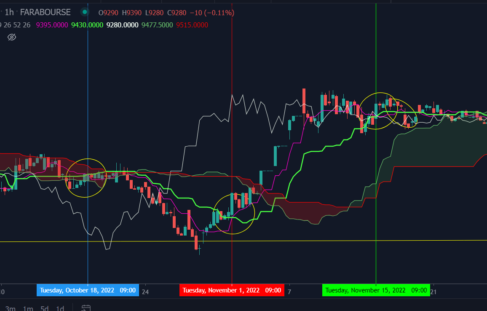

# (Ichimoku indicator)[https://www.investopedia.com/terms/i/ichimoku-cloud.asp]

- (Intersection Point Of Two Lines)[https://web.archive.org/web/20060911055655/http://local.wasp.uwa.edu.au/~pbourke/geometry/lineline2d]

## Calculation

```
There are five plots that make up the Ichimoku Cloud indicator. Their names and calculations are:

TenkanSen (Conversion Line): (High + Low) / 2 default period = 9
KijunSen (Base Line): (High + Low) / 2 default period = 26
Chiku Span (Lagging Span): Price Close shifted back 26 bars
Senkou A (Leading Span A): (TenkanSen + KijunSen) / 2 (Senkou A is shifted forward 26 bars)
Senkou B (Leading Span B): (High + Low) / 2 using period = 52 (Senkou B is shifted forward 26 bars)
```



```console
➜  Ichimoku git:(main) ✗ go run example/main.go

Calc ichi from Last 135 days
____ 
 Find ichi 8705|8710|8707.5|8930|8870|G:false,Chiko UP :true |status : nan |2022 Sun Oct 2 10:30:00 |1664699400000 
.____ 
 Find ichi 8630|8630|8630|8710|8430|G:false,Chiko UP :false |status : cross below |2022 Tue Oct 11 08:30:00 |1665469800000 
.____ 
 Find ichi 8685|8690|8687.5|8695|8550|G:false,Chiko UP :false |status : cross inside |2022 Tue Oct 18 08:30:00 |1666074600000 
.____ 
 Find ichi 8135|8135|8135|8295|8450|G:false,Chiko UP :true |status : cross below |2022 Tue Nov 1 07:30:00 |1667284200000 
.____ 
 Find ichi 9485|9525|9505|8790|9430|G:true,Chiko UP :false |status : cross above |2022 Tue Nov 15 08:30:00 |1668497400000 
.____ 
 Find ichi 9570|9545|9557.5|8980|9470|G:true,Chiko UP :false |status : cross above |2022 Wed Nov 16 09:30:00 |1668587400000 
.190
```